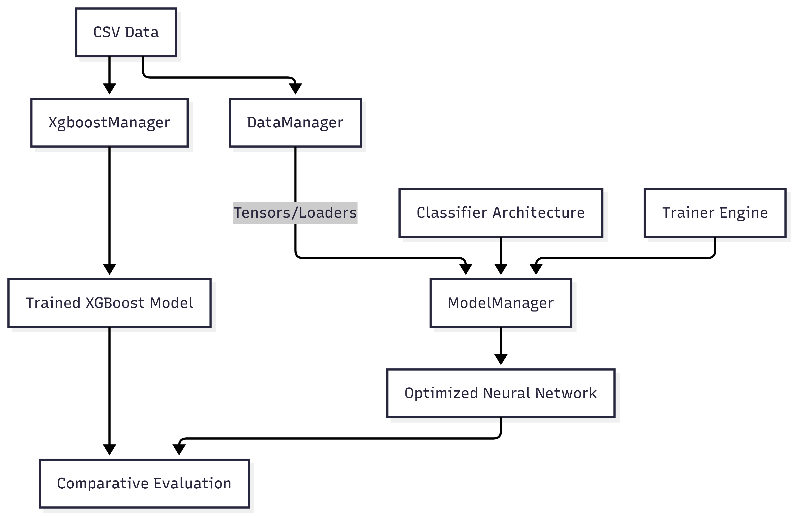

# 📊 Comparative Analysis of PyTorch and XGBoost in Customer Behavior Modeling

    


## About the Project

The main goal of the project is to show the role of the different paradigms of machine learning: **Neural Networks**, **Gradient Boosted Trees** and the role of **exploratory data analysis**. The major objective was to evaluate their predictive power and stability and a role of EDA in context of customer churn.

The study shows how different complexity of EDA directly affects model performance. By implementing a modular architecture, the project asses easy **experimentation, reproducibility, and seamless comparison between diverse modeling approaches.**


### 🗂 Table of Contents

- [📊 Comparative Analysis of PyTorch and XGBoost in Customer Behavior Modeling](#-comparative-analysis-of-pytorch-and-xgboost-in-customer-behavior-modeling)
  - [About the Project](#about-the-project)
    - [🗂 Table of Contents](#-table-of-contents)
  - [Dataset](#dataset)
  - [Experiment Methodology](#experiment-methodology)
    - [1. Data Variants (Simple vs Solid)](#1-data-variants-simple-vs-solid)
    - [2. Model Architectures](#2-model-architectures)
  - [Project Structure \& Architecture](#project-structure--architecture)
    - [Track A: Neural Network Ecosystem (PyTorch)](#track-a-neural-network-ecosystem-pytorch)
    - [Track B: Gradient Boosting Pipeline (XGBoost)](#track-b-gradient-boosting-pipeline-xgboost)
    - [Comparative Interface](#comparative-interface)
  - [Key Results \& Evaluation](#key-results--evaluation)
    - [Performance Summary](#performance-summary)
    - [Key Findings](#key-findings)
    - [Business Perspective](#business-perspective)
  - [Technologies Used](#technologies-used)
  - [Installation \& Usage](#installation--usage)
    - [1. Requirements](#1-requirements)
    - [2. Installation](#2-installation)
    - [3. Running the Project](#3-running-the-project)
    - [Conclusion](#conclusion)

## Dataset

The project is based on the **Bank Customer Churn Prediction** dataset, which provides foundation for behavioral modeling and binary classification tasks.

* **Source:** [Kaggle - Bank Customer Churn Dataset](https://www.kaggle.com/datasets/gauravtopre/bank-customer-churn-dataset)
* **Scope:** The dataset contains records for 10,000 bank customers, featuring demographic attributes and financial behavior indicators.
* **Key Features:** It includes variables such as `Credit Score`, `Geography`, `Gender`, `Age`, `Tenure`, `Balance`, `Number of Products`, and `Activity Status`.
* **Target Variable:** `Churn` (1 if the customer left the bank, 0 if they stayed).

This dataset was chosen for its clean structure, allowing the experiment to focus primarily on the impact of feature engineering and the differences between model architectures.


## Experiment Methodology

In the experiment we test two independent variables: the **model type** and **depth of data preparation**. This approach allow us to determine correlation between different variables.

### 1. Data Variants (Simple vs Solid)

To evaluate impact and role of **Exploratory Data Analysis**  two distinct **EDA** was performed with a distinct complexity.

* **Simple Variant (Control Gropu)**
  * **Features:** Chosen basline variables: `Country`, `Gender`, `Age`, `Balance`, `Products Number`,
  * **Preprocessing:** Minimal preparation was made to establish performance benchmark.
* **Solid Variant (Experimental Group)**
  * **Feature engeeniring:** By combining stratified age `age_group` and bussines variables `balance`, `credit_score`, `tenure` were created new features.
  * **Data Integrity:** Features that engeenired during data analysis were later in model recreated to prevent data leakage.
  * **Data transformations:** Implementation of log transformations and categorical binning.

### 2. Model Architectures

The project compares to different mathematical aprochase compairing **Forest** and **Neural Network** models.

* **Neural Network (Pytorch Implementation)**
  * **Architecutre:** A deep Multi-Layer Perceptron consisting of four linear layers with decreasing dimensionality.
  * **Regularization:** Implementation of `BatchNorm1d`
  * **Training Logic** Custom `Trainer` class with **Early Stopping mechanism saving best performing model.
* **Gradient Boosted Trees (XGboost):**
  * **Imbalance Handling:** Use of `scale_pos_weight` to cover problem of inbalanced classes.
  * **Flexibility:** Managed through dedicated `XgboostManager` for easier benchmarking.


## Project Structure & Architecture

The project follows two independent paths: a **modular ecosystem** for the Neural Network and a **standalone pipeline** for XGBoost. 



### Track A: Neural Network Ecosystem (PyTorch)
This track follows a highly modular architecture, separating the model definition from the training logic and data managment.

* **`model.py` (The Architecture):** Defines the PyTorch `Classifier` (MLP) architecture.
* **`trainer.py` (The Engine):** A dedicated class for the training lifecycle. It handles backpropagation, validation monitoring, and the **Early Stopping**.
* **`data_manager.py` (The Pipeline):** Responsible for converting raw data into PyTorch Tensors and `DataLoaders`. It manages the "Solid" feature engineering specifically for the NN track.
* **`model_manager.py` (The Orchestrator):** The high-level interface that glues the Model, Trainer, and DataManager together into a single workflow.

### Track B: Gradient Boosting Pipeline (XGBoost)
This track is typical for tree-based ensemble models.

* **`xgboost_manager.py` (Independent Manager):**
    * Unlike the NN track, this module is **self-contained**. 
    * It manages the entire lifecycle from data preparation to final evaluation using the XGBoost library, including specific handling for class imbalance.

### Comparative Interface
* **`models_evaluations.ipynb`**: The final meeting point where results from both independent tracks are aggregated and compared using standardized metrics.


## Key Results & Evaluation

The final phase of the project is a comparative analysis. The goal was to determine the optimal configuration of data depth and type of the architecture.

### Performance Summary

| Experiment | Accuracy | F1-Score | Precision | Recall | ROC-AUC |
| :--- | :---: | :---: | :---: | :---: | :---: |
| **XGB_Solid** | **0.8110** | **0.6197** | **0.5247** | 0.7567 | 0.8665 |
| **XGB_Simple** | 0.8010 | 0.6074 | 0.5074 | 0.7567 | 0.8694 |
| **NN_Simple** | 0.7452 | 0.5679 | 0.4332 | 0.8246 | **0.8698** |
| **NN_Solid** | 0.7352 | 0.5593 | 0.4225 | **0.8275** | 0.8637 |


### Key Findings

* **XGBoost & Feature Engineering:** The `XGB_Solid` variant achieved the highest overall **Accuracy (0.811)** and **F1-score (0.619)**. This proves that tree-based models benefit significantly from the extended EDA analysis.
* **Neural Network Behavior:** On the other hand, the `NN_Simple` performs measurably better. This suggests that this specific MLP architecture was able on its own to find complex patterns, and new engineered features were creating unnecessary noise.

### Business Perspective

* **Recall Dominance:** From a business point of view, predominantly important is recall while we want to avoid any potential customer loss. In this task, much better performance is shown by the Neural Network model with **Recall (0.82)** than the XGBoost model with **Recall (0.76)**.
* **Precision Impact:** If from a business point of view accessing contact to the client is complicated or comes with high costs, we might want to use `XGB_Solid` models with higher **Precision (0.52)** and **Accuracy (0.81)** than `NN_Simple` with **Precision (0.43)** and **Accuracy (0.74)**.


## Technologies Used

The project uses Python and popular data science libraries, focusing on PyTorch and XGBoost.
* **Python 3.x**: Main programming language.
* **PyTorch (2.5.1)**: Used for building the Neural Network architecture, handling Tensors, and implementing the custom training engine.
* **XGBoost (3.1.2)**: High-performance gradient boosting framework used for the tree-based classification track.
* **Pandas (2.3.3) & NumPy (2.1.2)**: Core libraries for data manipulation, cleaning, and matrix operations.
* **Scikit-Learn (1.7.2)**: Utilized for dataset splitting (`train_test_split`), categorical encoding, and calculating evaluation metrics.
* **Matplotlib (3.10.7) & Seaborn (0.13.2)**: Used for data visualization and performance analysis during the EDA phase.
* **Jupyter Ecosystem**: Environments used for interactive experimentation and final model evaluation.

## Installation & Usage

### 1. Requirements
Ensure you have Python installed. It is recommended to use a virtual environment (venv) to avoid dependency conflicts.

### 2. Installation
Clone the repository and install the dependencies from the provided list:

```bash
# Clone the repository
git clone https://github.com/kubastrycharczyk/Comparative-Analysis-PyTorch-XGBoost.git
cd Comparative-Analysis-PyTorch-XGBoost

# Create and activate virtual environment
python -m venv venv
# Windows:
venv\Scripts\activate
# Unix/MacOS:
source venv/bin/activate

# Install dependencies
pip install -r requirements.txt
```

### 3. Running the Project
The project is organized to guide you through the analytical process, from raw data exploration to final model comparison:

1. **Analysis & Data Preparation Phase:**
   Explore the Jupyter notebooks to understand the feature engineering logic and data distribution:
   * `notebook_simple_eda.ipynb`: Baseline data preparation (Control Group).
   * `notebook_solid_eda.ipynb`: Advanced feature engineering and statistical analysis (Experimental Group).

2. **Model Training & Evaluation Phase:**
   Run the `models_evaluations.ipynb` notebook to execute the full experiment. This notebook manages the `ModelManager` (for PyTorch) and `XgboostManager` (for XGBoost), trains the models on both data variants, and generates the final comparative metrics.

---

### Conclusion

The comparative analysis reveals a clear strategic trade-off between the two modeling paradigms, depending on the specific business requirements:

* **For High-Risk Mitigation (Recall-oriented):** If the primary goal is to capture as many potential churners as possible to prevent customer loss at any cost, the **Neural Network** is the superior choice. Its significantly higher **Recall (~0.82)** ensures that the vast majority of at-risk customers are identified.

* **For Resource Optimization (Precision-oriented):** If the cost of customer intervention (e.g., expensive marketing offers) is high, the **XGBoost (Solid)** model is the optimal choice. It provides the highest **Accuracy (0.81)** and **Precision (0.52)**, ensuring that the business resources are targeted at the most likely churners while minimizing "false alarms."

Ultimately, the experiment proves that while **XGBoost** benefits heavily from feature engineering ("Solid" variant), the **Neural Network** demonstrates a robust ability to extract strong predictive patterns even from simpler data structures.

---
*Author: Jakub Strycharczyk*
